# Sector-Rotation Grid Trading

## Leakage-Controlled Grid Trading on Vietnamese Stocks

> Select a recently oscillating sector and its most grid-suitable stocks,
> freeze the selection for the following month, and route every grid order
> through a realistic account and execution simulator.

## Abstract

This project implements a long-only grid trading strategy on liquid Vietnamese
banking and securities stocks. The strategy first removes broad-market
movement from each stock return, then ranks sectors and tickers using residual
oscillation, after-cost amplitude, reversal consistency, downside risk and
liquidity.

The research follows a chronological process:

1. develop the ticker selector using 2022 data;
2. test the initial hypothesis in sample using 2023 data;
3. optimize a compact grid parameter set using 2024 data;
4. freeze the configuration;
5. open January–June 2025 once for loss diagnosis;
6. leave the July 2025 onward final holdout locked.

The 2023 in-sample strategy earned VND 618,617 on VND 1 billion. However,
every 2024 optimization configuration lost money. The unchanged configuration
then lost VND 12.67 million in the diagnostic OOS period.

The principal finding is not simply that fees were high. In normal conditions,
the gross grid edge was too small to cover costs. During abrupt downtrends,
multiple grid cells accumulated inventory before the lagging regime filter
reacted, and T+2 delayed liquidation. The average risk-exit loss was about
9.36 times one average grid-target profit.

## Introduction

Grid trading places buy orders below a reference price and sells acquired
inventory when price reverts toward a higher grid level. It attempts to
capture repeated oscillations without forecasting a long-term price target.

The basic process is:

- select a sector and one or two stocks using information available at the
  monthly cutoff;
- place several geometric buy levels below the cutoff price;
- buy one or more 100-share cells when observable minute-book conditions
  satisfy the limit;
- sell each cell at its next higher grid level;
- stop accumulating and liquidate when a severe decline is detected;
- close and settle the complete portfolio before the next rotation.

The strategy is intended for:

- stocks with sufficient oscillation after transaction costs;
- market-adjusted price series displaying reversal consistency;
- liquid securities with observable bid/ask depth;
- periods without a severe broad-market or stock-specific downtrend.

The implementation does not assume that every daily high or low was
executable. It uses observed minute-level bid/ask prices, displayed depth,
matched volume, fees, tax and T+2 settlement.

## Hypothesis

The research hypothesis is:

> A sector and ticker with sufficient after-cost residual oscillation, low
> directional efficiency, observable reversal consistency, limited downside
> risk and adequate liquidity will generate positive grid expectancy during
> the next monthly deployment period.

### Market-adjusted residual

For stock $i$:

$$
\epsilon_{i,t}
=
r_{i,t}-\beta_i r_{\text{market},t}
$$

where:

- $r_{i,t}$ is the stock return;
- $r_{\text{market},t}$ is the equal-weight market-proxy return;
- $\beta_i$ is the stock's rolling sensitivity to that proxy;
- $\epsilon_{i,t}$ is the unexplained or residual return.

The residual displacement series is:

$$
S_{i,t}
=
\sum_{\tau}\epsilon_{i,\tau}
$$

### Residual efficiency

$$
ER_L
=
\frac{|S_t-S_{t-L}|}
{\sum_{j=1}^{L}|S_j-S_{j-1}|}
$$

- low $ER$: substantial back-and-forth movement;
- high $ER$: persistent directional movement.

### Tradable amplitude

Robust residual amplitude is:

$$
A_L=Q_{90}(S)-Q_{10}(S)
$$

The selector subtracts the estimated round-trip hurdle:

$$
A_L^{net}
=
A_L-
\left(
\text{commission}
+\text{sell tax}
+\text{spread}
+\text{execution haircut}
\right)
$$

A ticker is rejected when residual amplitude is insufficient to exceed this
hurdle.

### Reversal consistency

The selector measures how often a sufficiently large residual displacement
subsequently moves back toward its recent centre. Tickers with no qualifying
reversal events are excluded.

### Ticker and sector score

Eligible tickers receive an equal-rank composite:

$$
\text{Grid Score}
=
\frac{
\operatorname{Rank}(1-ER)
+\operatorname{Rank}(A^{net})
+\operatorname{Rank}(\text{Reversal Rate})
}{3}
$$

Liquidity and severe-downtrend risk are hard gates rather than compensating
score components.

A sector must contain at least two eligible tickers. Its score is the median
score of its two highest-ranked eligible stocks. The highest-ranked sector
and its top two stocks are frozen for the following month.

### Grid formulas

For reference price $C$, spacing $g$, and level $i$:

$$
\text{Buy}_i
=
\frac{C}{(1+g)^i}
$$

$$
\text{Target}_i
=
\frac{C}{(1+g)^{i-1}}
$$

Spacing is volatility adjusted:

$$
g
=
\operatorname{clip}
\left(
0.75\times ATR20\%,
0.8\%,
2.5\%
\right)
$$

The frozen optimized grid uses:

- four geometric levels;
- three independent 100-share cells per level;
- at most two selected stocks;
- up to 45% capital allocation per selected ticker;
- 10% minimum aggregate cash reserve.

Using independent board-lot cells allows the account to liquidate inventory
incrementally instead of requiring one large all-or-none exit.

## Data

### Data source

- **Source:** Algotrade database
- **Daily data:** OHLC, ceiling, floor and matched volume
- **Minute data:** matched prices, level-one bid/ask, displayed depth and
  matched quantity
- **Exchange:** HSX
- **Instruments:**
  - banks: MBB, TCB, VCB and VPB;
  - securities: SSI and VND.

FPT and PNJ were removed from the active universe. HPG and MWG were not used
because each would form a one-stock “sector,” which would not constitute a
genuine sector-rotation comparison.

### Chronological research periods

| Research stage | Period | Sessions | Purpose |
|---|---|---:|---|
| Selector development | 2022-01-04–2022-12-30 | 249 | Select and freeze indicator horizon |
| In-sample trading | 2023-01-03–2023-12-29 | 249 | Test the initial hypothesis |
| Optimization | 2024-01-02–2024-12-31 | 250 | Select grid parameters |
| Internal diagnostic OOS | 2025-01-02–2025-06-30 | 119 | Diagnose the frozen strategy |
| Unused buffer | 2025-07-01–2025-07-11 | 9 | Settlement/data separation |
| Locked final holdout | 2025-07-14–2026-07-16 | 252 | Not opened |

The January–June 2025 block was opened after the development gate had failed.
It is therefore labelled **diagnostic OOS**, not performance confirmation.

### Non-overlap rule

For every rotation:

$$
\max(\text{feature date})
<
\min(\text{deployment date})
$$

The selector-development period is also disjoint from every trading-evaluation
period. The generated split audit reports:

```text
selector/trading overlap sessions = 0
```

Completed deployment data may become historical information for the next
rotation. Future deployment data can never enter its own selection.

### Benchmark limitation

The repository does not contain official VN-Index or sector-index history.
Therefore, market adjustment and performance charts use a clearly labelled
equal-weight proxy constructed from the six bank and securities stocks.

This proxy must not be described as VN-Index performance. The benchmark
interface can be replaced when an authoritative index series is supplied.

### Transaction assumptions

```text
buy commission                 0.15%
sell commission                0.15%
sell tax                       0.10%
execution haircut              5 basis points per side
maximum normal spread          40 basis points
maximum minute participation   5%
board lot                      100 shares
settlement                     T+2 at 13:00
```

These rates are configurable research assumptions and are not claims about
every broker's current fee schedule.

## Implementation

### Environment setup

The active strategy uses the Python standard library. It has been tested in
the current environment with Python 3.15.

Create a virtual environment:

```bash
python3 -m venv venv
source venv/bin/activate
```

Optional minute-data backfill dependencies are listed separately:

```bash
pip install -r requirements-backfill.txt
```

### Create chronological splits

```bash
python3 create_sector_rotation_splits.py
```

Generated files:

```text
data/sector_rotation_splits/
├── date_assignments.csv
└── split_audit.json
```

The split builder rejects:

- duplicate ticker/date rows;
- incomplete ticker universes;
- mixed primary split labels;
- selector-development/trading overlap.

### Execution and account platform

`grid_platform.py` owns:

- order validation;
- causal order activation;
- bid/ask and last-trade confirmation;
- spread, displayed-depth and participation gates;
- fees and sell tax;
- T+2 stock and cash settlement;
- settled and unsettled inventory;
- FIFO campaign cost basis;
- realized and unrealized P&L;
- continuous account NAV.

An order cannot fill on the same snapshot that created it.

A limit order is considered matched only when:

- a later snapshot is observed;
- the correct side of the book reaches the limit;
- the last traded price confirms penetration;
- the spread is acceptable;
- displayed depth is sufficient;
- minute-volume capacity is sufficient;
- the account has available cash or settled inventory.

The account identity is:

$$
\text{NAV}
=
\text{available cash}
+\text{pending sale cash}
+\text{estimated net liquidation value of inventory}
$$

### Selector development and optimization

Run:

```bash
python3 sector_rotation_grid.py develop
```

This command:

1. compares 20-, 40- and 60-session selector horizons using 2022 only;
2. freezes the selected horizon;
3. runs the 2023 in-sample backtest;
4. evaluates twelve grid configurations using 2024 only;
5. writes a hashed frozen configuration;
6. produces performance and diagnostic charts.

### Diagnostic OOS

The unchanged configuration hash is:

```text
96d02d50e5df00582c5eba186202570f7b49bcf3d74bfec36e4aec8c5286e9ab
```

The internal OOS block was opened with:

```bash
python3 sector_rotation_grid.py oos \
  --confirm-frozen-config 96d02d50e5df00582c5eba186202570f7b49bcf3d74bfec36e4aec8c5286e9ab \
  --diagnostic-oos-after-failed-gate
```

The output now exists, so the implementation refuses to rerun this command.
The final holdout remains filtered before numeric values are parsed.

## Selector Development

### Horizon experiment

The 10-session window used in earlier research was not retained
automatically. Three economically interpretable horizons were compared using
the reserved 2022 selector-development block.

| Horizon | Active rotations | Tickers evaluated | Median future quality | Positive fraction |
|---:|---:|---:|---:|---:|
| 20 sessions | 7 | 14 | 3.458% | 71.4% |
| 40 sessions | 4 | 8 | −1.857% | 50.0% |
| 60 sessions | 1 | 2 | −0.472% | 50.0% |

The frozen selector horizon was **20 sessions**.

The broad-market veto was excluded only from the horizon-comparison
calculation because the 2022 veto otherwise left too few observations.
Future downside still penalized selector quality. The veto remained active
in every trading backtest.

## In-Sample Backtesting

The initial grid configuration was evaluated from 2023-01-03 through
2023-12-29 using VND 1 billion.

### In-sample result

| Metric | Value |
|---|---:|
| Net P&L | **+VND 618,617** |
| Total return | **+0.0619%** |
| Annualized Sharpe ratio | 0.1844 |
| Maximum drawdown | −0.1564% |
| Profit factor | 1.2211 |
| Completed sales | 83 |
| Active rotations | 7 of 12 |
| Equal-weight proxy return | +33.3397% |
| Active return | −33.2778% |

Account reconciliation:

```text
gross trading P&L      +VND 2,000,000
commission             -VND 1,035,293
sell tax               -VND   346,090
--------------------------------------
net realized P&L       +VND   618,617
reconciliation error                0
```

Although the strategy was slightly profitable in absolute terms, it
dramatically underperformed passive exposure during a strong benchmark year.

### In-sample charts

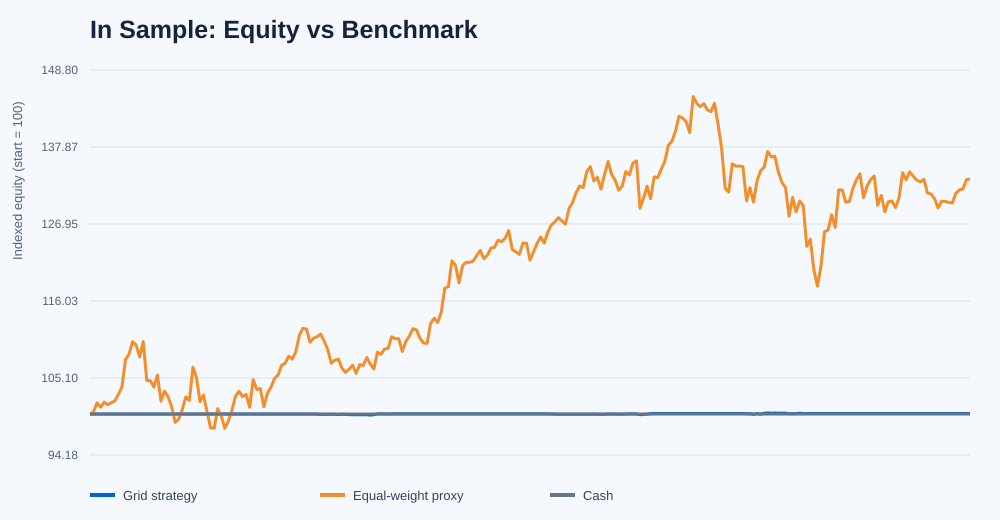

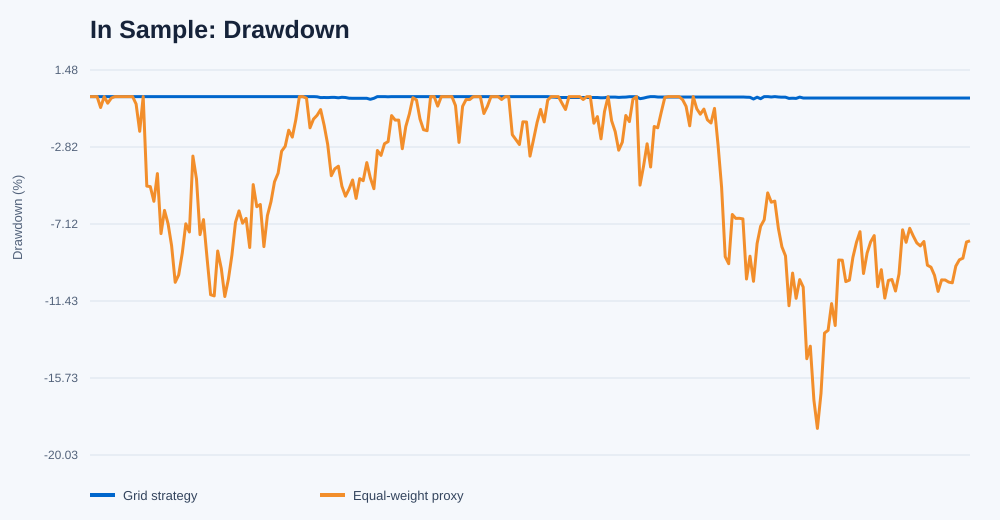

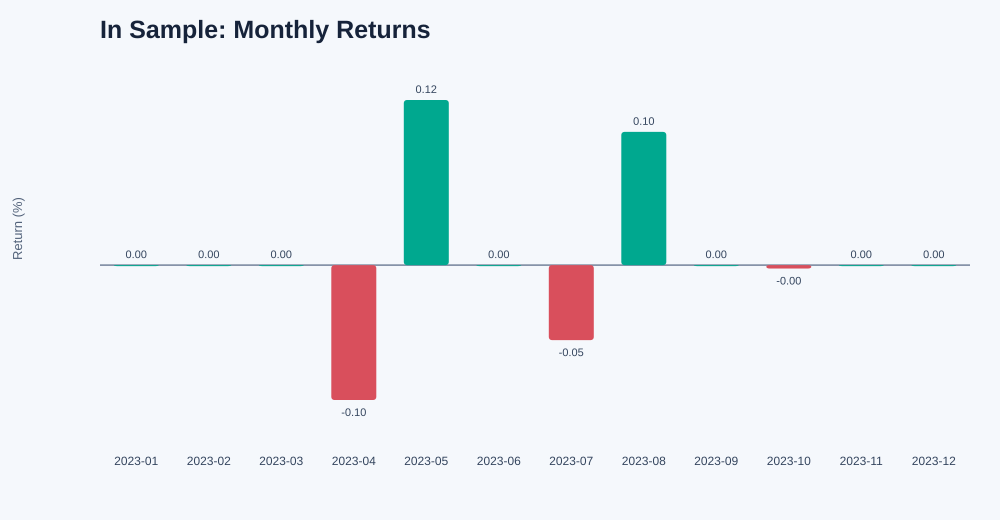

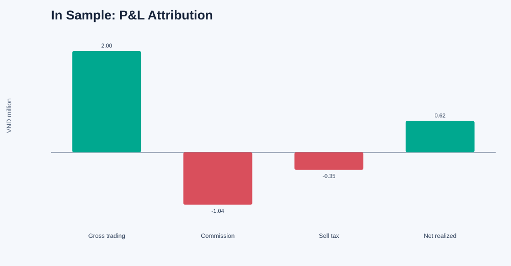

## Evaluation Metrics

The primary metrics are:

- total account return after costs;
- benchmark and active return;
- annualized daily Sharpe ratio;
- maximum drawdown;
- realized-trade profit factor;
- number of active rotations and completed sales;
- gross trading P&L;
- commission, sell tax and execution friction;
- loss attribution by exit type, ticker, sector, level and month.

The Sharpe ratio uses daily account returns:

$$
SR
=
\sqrt{252}
\frac{\operatorname{mean}(r_t)}
{\operatorname{std}(r_t)}
$$

No risk-free rate is subtracted in the current implementation. This must be
considered when comparing the reported Sharpe ratio with studies using a
positive risk-free rate.

## Optimization

The 2024 optimization tested a compact, pre-registered grid rather than a
large unconstrained parameter search.

### Parameters evaluated

- grid levels: 3 or 4;
- spacing multiplier: 0.75, 1.00 or 1.25 ATR;
- independent cells per level: 3 or 5;
- per-ticker allocation: fixed at 45%;
- order size: fixed at one 100-share board lot per cell.

This produced twelve configurations.

### Optimization result

| Statistic | Result |
|---|---:|
| Configurations tested | 12 |
| Profitable configurations | **0** |
| Best net P&L | **−VND 677,936** |
| Worst net P&L | −VND 7,184,350 |

The least-negative configuration used:

```json
{
  "levels": 4,
  "spacing_atr_multiplier": 0.75,
  "maximum_cells_per_level": 3,
  "allocation_per_ticker": 0.45
}
```

### Best optimization result

| Metric | Value |
|---|---:|
| Net return | **−0.0678%** |
| Annualized Sharpe ratio | −0.1355 |
| Maximum drawdown | −0.3970% |
| Profit factor | 0.8813 |
| Completed sales | 137 |
| Active rotations | 10 of 12 |
| Equal-weight proxy return | +11.1912% |
| Active return | −11.2589% |

Account reconciliation:

```text
gross trading P&L      +VND 1,430,000
commission             -VND 1,580,431
sell tax               -VND   527,505
--------------------------------------
net realized P&L       -VND   677,936
reconciliation error                0
```

Gross trading P&L remained positive, but commission and tax were approximately
147.4% of the gross edge.

Normal grid targets earned VND 5.02 million, while risk exits lost VND 4.80
million and scheduled wind-downs lost another VND 0.90 million.

### Optimization charts

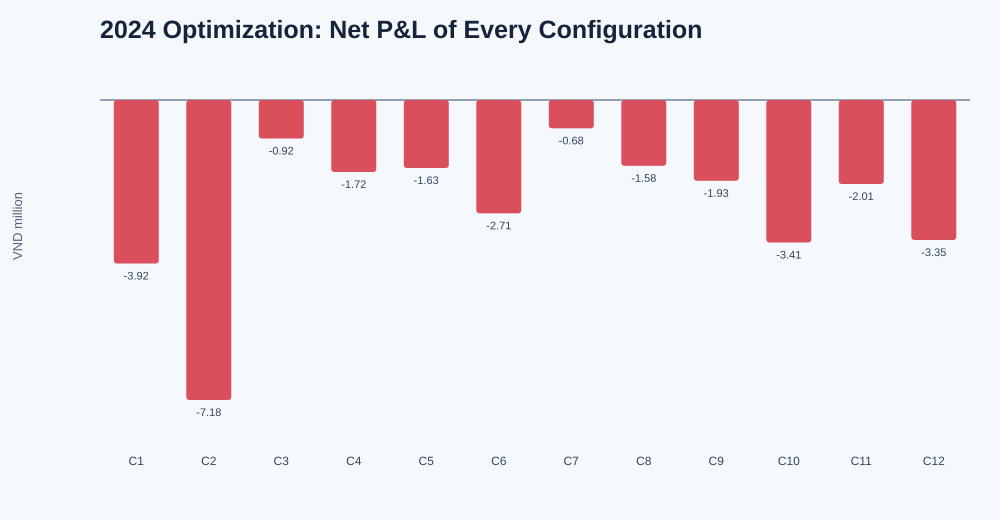

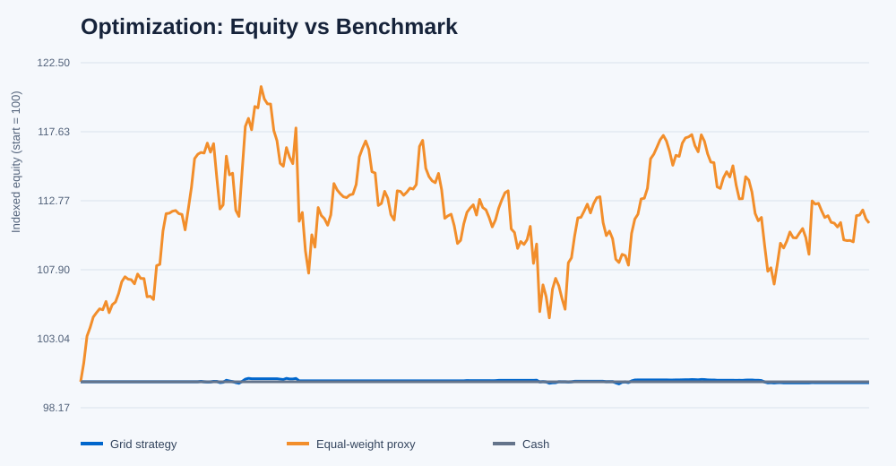

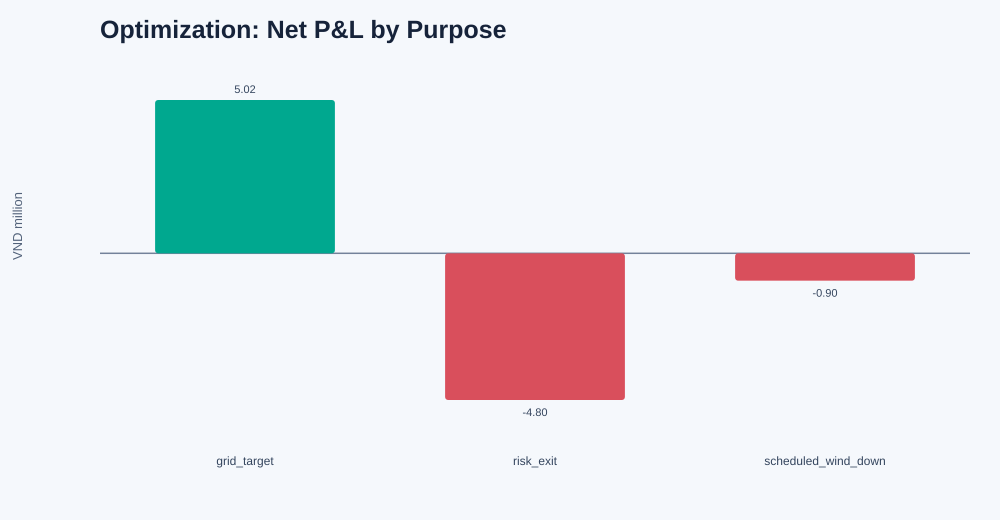

## Out-of-Sample Backtesting

The January–June 2025 internal OOS block was opened once using the unchanged
2024-selected configuration.

Because the development gate had failed, this run was explicitly authorized
for **loss diagnosis rather than performance confirmation**.

### OOS result

| Metric | Value |
|---|---:|
| Net P&L | **−VND 12,670,428** |
| Total return | **−1.2670%** |
| Annualized Sharpe ratio | −2.3281 |
| Maximum drawdown | −1.2670% |
| Profit factor | 0.0267 |
| Completed sales | 60 |
| Active rotations | 4 of 6 |
| Equal-weight proxy return | +13.3931% |
| Active return | −14.6602% |

Account reconciliation:

```text
gross trading P&L      -VND 11,820,000
commission             -VND    642,258
sell tax               -VND    208,170
--------------------------------------
net realized P&L       -VND 12,670,428
reconciliation error                 0
```

Unlike the optimization loss, the OOS failure was already present before
transaction costs.

### OOS loss by exit mechanism

| Exit type | Sales | Net P&L | Average P&L |
|---|---:|---:|---:|
| Normal grid target | 12 | **+VND 347,841** | +VND 28,987 |
| Severe-risk exit | 48 | **−VND 13,018,269** | −VND 271,214 |

Every grid target was profitable, but every risk exit lost money.

The average risk-exit loss was:

$$
\frac{271{,}214}{28{,}987}
\approx
9.36
$$

times one average grid-target profit.

### OOS loss by rotation

| Rotation | Selected tickers | Net P&L | Main outcome |
|---|---|---:|---|
| January 2025 | VPB, MBB | −VND 2,789,463 | 24 risk exits |
| February 2025 | VPB, VCB | +VND 295,890 | 9 grid targets |
| March 2025 | MBB, VPB | +VND 51,951 | 3 grid targets |
| April 2025 | VCB, TCB | **−VND 10,228,806** | 24 risk exits |
| May 2025 | None | VND 0 | Market veto active |
| June 2025 | None | VND 0 | Market veto active |

April produced approximately 81% of the complete OOS loss.

### OOS charts

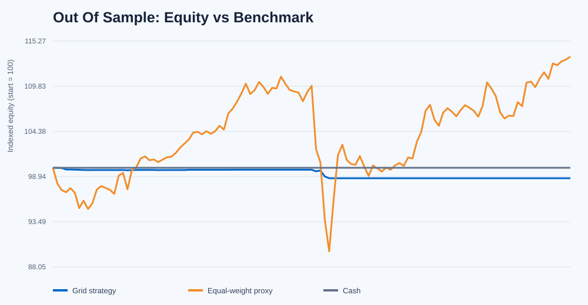

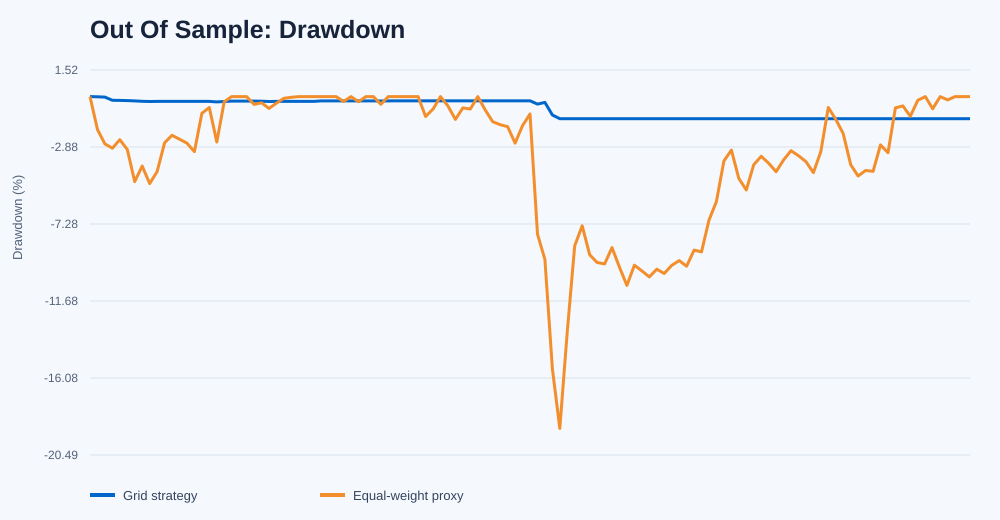

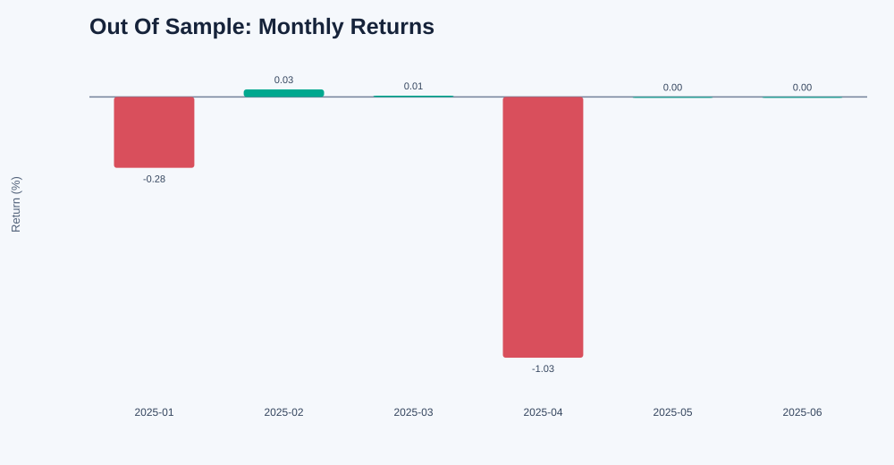

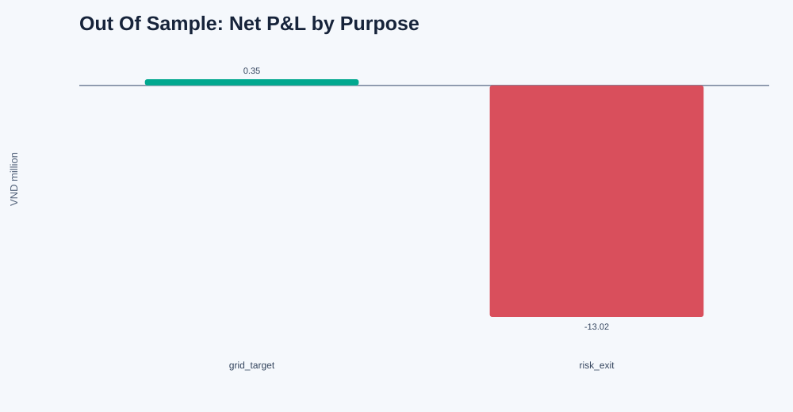

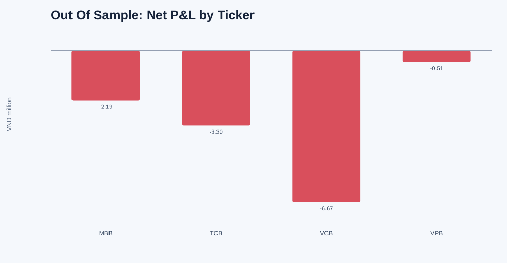

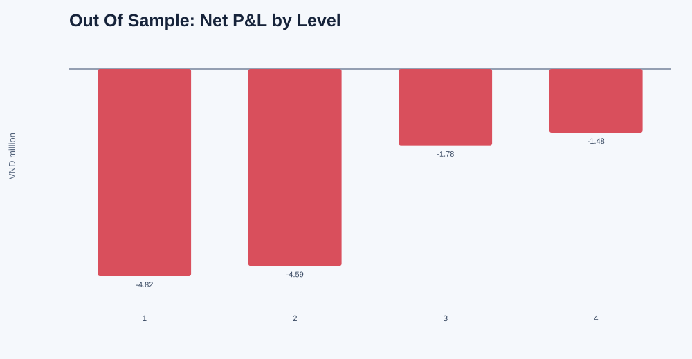

## Discussion

### Strategy performance analysis

The clean selector/in-sample/optimization/OOS sequence reveals two separate
failure mechanisms.

#### 1. Small gross edge relative to costs

During 2024, the grid generated positive gross trading P&L, but the edge was
smaller than commission and sell tax. Increasing the number of cells increased
turnover and therefore often increased the loss.

This means that a statistically observable reversal is not sufficient. Its
expected price movement must exceed the complete executable cost hurdle by a
meaningful margin.

#### 2. Negative convexity during abrupt downtrends

The selector described recent conditions but could not guarantee that the next
month would remain mean reverting.

The principal OOS sequence was:

```text
recent residual oscillation
        ↓
ticker selected and grid activated
        ↓
new downtrend begins after selection
        ↓
several lower grid cells fill
        ↓
inventory remains unsettled under T+2
        ↓
risk exit becomes executable after a larger loss
```

In April 2025:

- TCB purchases averaged approximately VND 26,550 and were liquidated around
  VND 23,900;
- VCB purchases averaged approximately VND 59,575 and were liquidated around
  VND 54,025.

The purchases occurred on 3–4 April, while liquidation occurred on 8–9 April.

#### 3. Lagging regime protection

The market veto was not useless. It correctly left the account in cash during
May and June. However, it reacted after the April decline rather than
protecting inventory before the new regime began.

#### 4. Benchmark underperformance

The strategy maintained low capital utilization and therefore had much
smaller drawdowns than the equal-weight proxy. However, it also substantially
underperformed passive exposure in every evaluated trading block.

Low drawdown alone should not be interpreted as attractive performance when
the active return is strongly negative.

### Main conclusion

The study does not show that every possible grid strategy is impossible. It
shows that this unhedged long-only implementation has two unfavorable economic
properties:

1. ordinary grid profits are small relative to trading costs;
2. occasional inventory exits are much larger than ordinary grid wins.

Ticker selection, sector rotation, volatility-based spacing, additional
capital and hard risk exits did not remove this asymmetry.

### Potential next research

Any further research should change the economic object rather than merely
searching more grid parameters:

- obtain an authoritative VN-Index or sector-index series;
- study a genuinely hedged stock/index or stock/sector residual;
- test a single-entry residual trade before applying a grid;
- require expected residual movement to exceed the full cost hurdle;
- model hedge margin, basis and contract roll;
- preserve T+2 and one continuous portfolio ledger;
- obtain new unseen data for any future confirmation.

The July 2025 onward final holdout should remain locked for this long-only
strategy.

## Project Structure

```text
Grid_Trading_Strategy/
├── README.md
├── grid_platform.py
├── create_sector_rotation_splits.py
├── sector_rotation_grid.py
├── backfill_minute_bars.py
├── requirements-backfill.txt
├── data_algotradeDB_split.csv
├── data/
│   ├── minute_bars/
│   ├── sector_rotation_splits/
│   │   ├── date_assignments.csv
│   │   └── split_audit.json
│   └── sector_rotation_grid/
│       ├── selector_lock.json
│       ├── selector_horizon_results.csv
│       ├── optimization_results.csv
│       ├── frozen_config.json
│       ├── in_sample/
│       ├── optimization_best/
│       ├── optimization_diagnostics/
│       ├── out_of_sample/
│       └── oos_summary.json
├── tests/
│   ├── test_grid_platform.py
│   ├── test_create_sector_rotation_splits.py
│   └── test_sector_rotation_grid.py
├── research_log/
│   ├── SECTOR_ROTATION_REIMPLEMENTATION_PLAN.md
│   ├── SECTOR_ROTATION_GRID_V1_DEVELOPMENT_RESULT.md
│   └── SECTOR_ROTATION_GRID_V1_DIAGNOSTIC_OOS_RESULT.md
└── archive/
    └── legacy_trials/
```

## Testing

Run the active test suite:

```bash
python3 -m unittest discover -s tests -p 'test_*.py' -v
```

The suite verifies:

- non-overlapping chronological roles;
- locked final-test numeric isolation;
- causal order activation;
- limit-touch and trade confirmation;
- spread and liquidity gates;
- exact fee and tax cash flows;
- T+2 stock and sale-cash settlement;
- account NAV reconciliation;
- OOS gate and single-opening behavior;
- diagnostic exit attribution.

## References

1. ALGOTRADE, *Algorithmic Trading Theory and Practice—A Practical Guide with
   Applications on the Vietnamese Stock Market*, 1st ed., DIMI BOOK, 2023,
   Chapter 3. [Knowledge Hub](https://hub.algotrade.vn/knowledge-hub/)
2. Project execution assumptions and results:
   `research_log/SECTOR_ROTATION_GRID_V1_DEVELOPMENT_RESULT.md`
3. Diagnostic OOS analysis:
   `research_log/SECTOR_ROTATION_GRID_V1_DIAGNOSTIC_OOS_RESULT.md`
