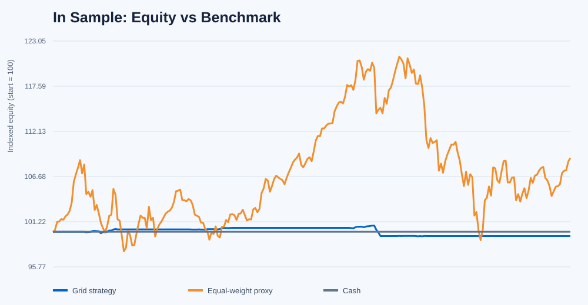
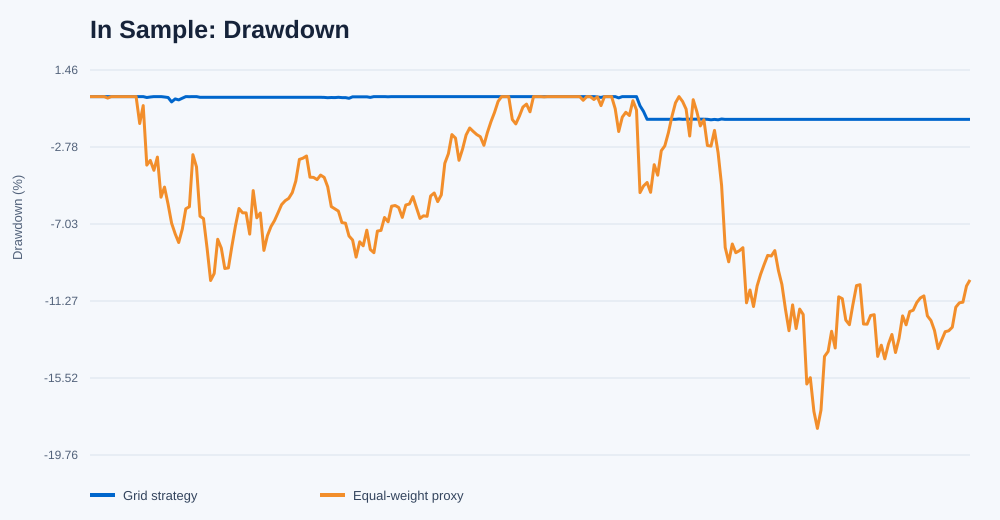
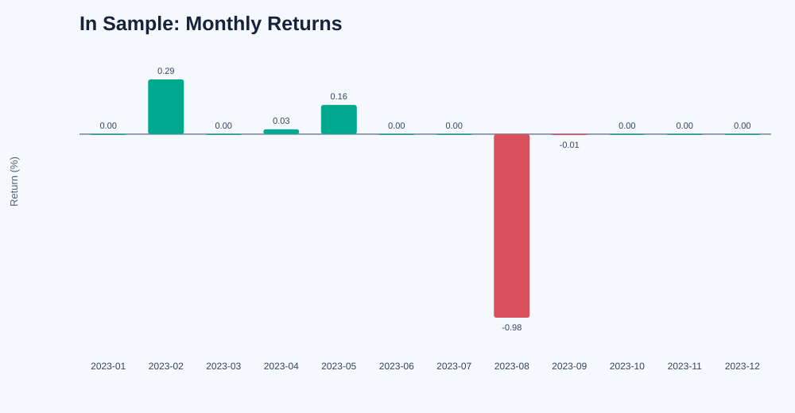
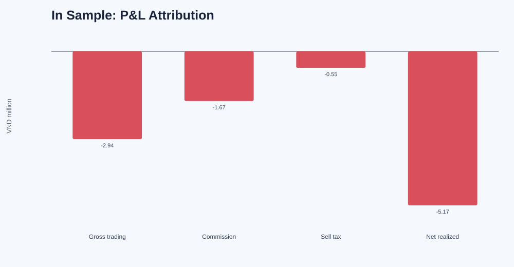
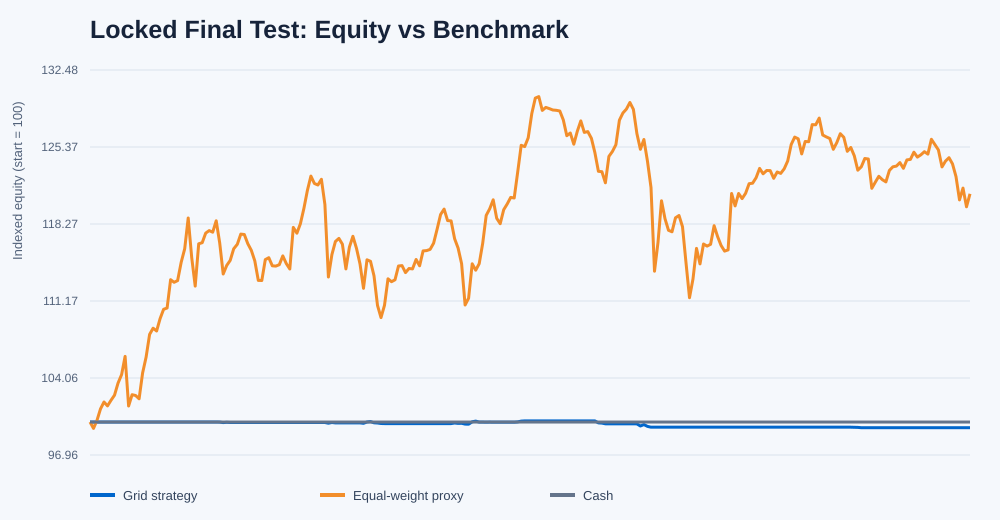
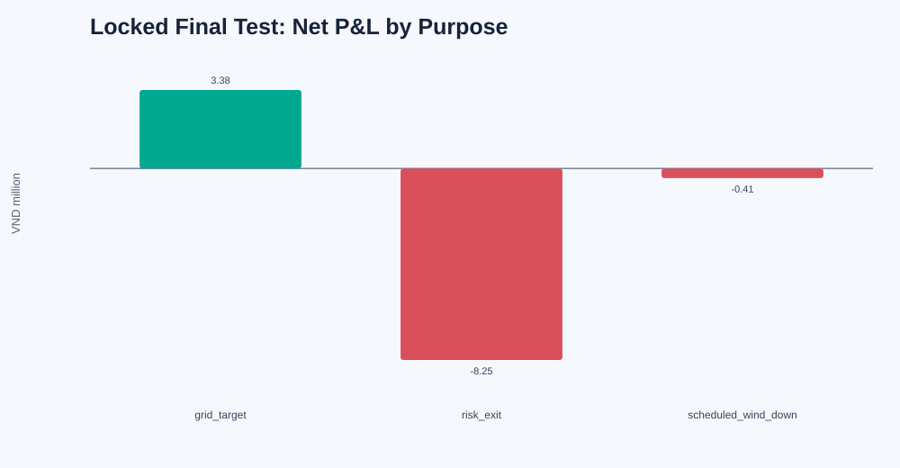
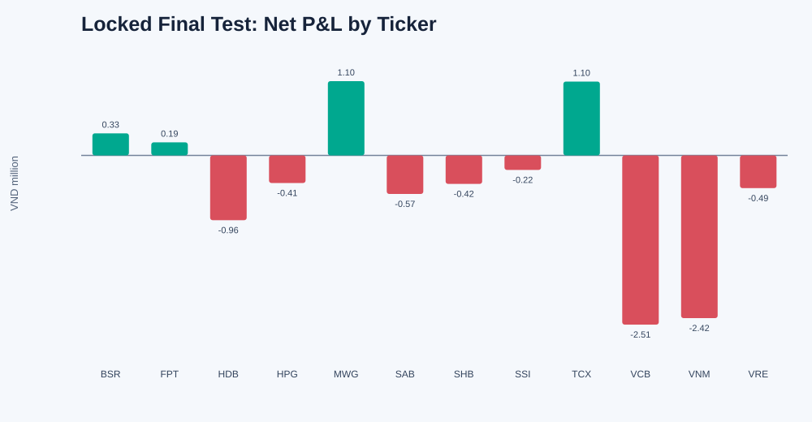
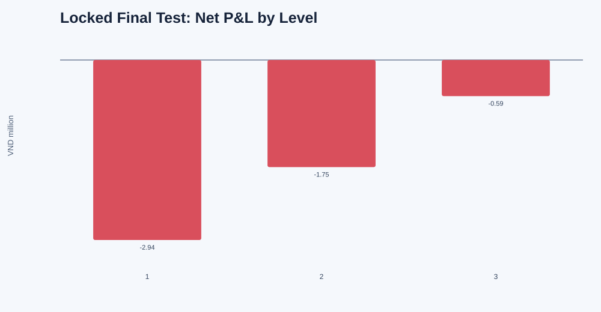

#  Grid Trading on Vietnamese Stocks

This repository tests a long-only grid strategy on a fixed 30-stock VN30
research universe. It uses daily data for causal selection and grid
construction, then minute bid/ask and matched-trade data for execution.


## Research hypothesis

Stocks that recently moved back and forth around a market-adjusted centre,
with enough movement to exceed estimated costs, may continue to provide
short-horizon reversal opportunities and earn profit during the next month.

A negative price deviation alone is not treated as proof of reversal. The
selector first requires recent oscillation, adequate amplitude, observed
reversals, liquidity and acceptable downside conditions.
### Data source

- **Source:** Algotrade database
- **Daily data:** OHLC, ceiling, floor and matched volume
- **Minute data:** matched prices, level-one bid/ask, displayed depth and
  matched quantity
- **Length**: 2022-01-04 to 2026-07-16

### Fixed VN30 research universe

```text
ACB, BID, BSR, CTG, FPT, GAS, GVR, HDB, HPG, LPB,
MBB, MCH, MSN, MWG, SAB, SHB, SSB, SSI, STB, TCB,
TCX, VCB, VHM, VIB, VIC, VJC, VNM, VPB, VPL, VRE
```

These are the VN30 constituents effective 2026-08-03. They are applied as a
fixed universe across the historical experiment, rather than using historical
point-in-time index membership. This creates survivorship look-ahead, so the
study is a current-constituent sensitivity and not a bias-free historical VN30
backtest. BSR, VPL, TCX and MCH become eligible only after their first HSX
session and sufficient selector history; observations are never invented
before listing or transfer.

## Chronological protocol

| Stage | Period | Sessions | Information use |
|---|---|---:|---|
| Selector development | 2022-01-04 to 2022-12-30 | 249 | Choose the selector horizon only |
| In-sample backtest | 2023-01-03 to 2023-12-29 | 249 | Test the initial trading rules |
| Optimization | 2024-01-02 to 2024-12-31 | 250 | Choose grid parameters |
| Validation | 2025-01-02 to 2025-06-30 | 119 | Evaluate the selected configuration once for robustness and identify suitability for final testing |
| Exclusion buffer | 2025-07-01 to 2025-07-11 | 9 | Data separation |
| Retrospective final evaluation | 2025-07-14 to 2026-07-16 | 252 | Evaluate the frozen VN30-universe version |

The split is strictly chronological and non-overlapping. For every monthly
deployment, the selection cutoff is earlier than the first tradable session.
The implementation reports zero selection/deployment overlaps in every stage.

## What is selected

The 2022 development procedure selected a 40-session lookback. For each stock it
removes movement associated with a leave-one-out equal-weight market proxy and
ranks eligible stocks equally on:

1. lower directional efficiency, meaning more back-and-forth residual movement;
2. larger residual amplitude after the estimated round-trip cost hurdle;
3. a higher observed reversal rate toward the recent centre.

Liquidity, spread, drawdown, recent-return and reversal-event checks are hard
eligibility gates. All available VN30 names are ranked together: there is no
sector-first selection. The selector chooses at most two stocks at each
monthly cutoff and freezes them for the following deployment month. A broad
market decline condition may leave the strategy entirely in cash.

## Exact grid construction

This implementation uses a **geometric grid**.
Consecutive levels are separated by approximately the same percentage rather
than the same VND amount.

### Reference price

For each selected stock, the reference price `R` is its daily closing price on
the monthly selection cutoff. It remains fixed during that deployment month.

### Grid spacing

First calculate the true range for each of the 20 completed daily sessions
available at the cutoff:

```text
true_range_t = max(
    high_t - low_t,
    abs(high_t - close_(t-1)),
    abs(low_t - close_(t-1))
)
```

The daily volatility estimate and grid spacing are:

```text
ATR20_percentage = average(true_range_t / close_(t-1))

grid_spacing = min(2.5%, max(0.8%, 1.25 * ATR20_percentage))
```

Therefore:

- if `ATR20_percentage = 0.5%`, spacing is floored at `0.8%`;
- if `ATR20_percentage = 1.2%`, spacing is `1.5%`;
- if `ATR20_percentage = 4.0%`, spacing is capped at `2.5%`.

Spacing uses only completed **daily** data through the selection cutoff. It is
not based on intraday ATR, and transaction costs do not directly set the
spacing. Costs affect ticker eligibility and realized execution separately.

### Buy levels and sell targets

For grid level `k = 1, 2, 3`:

```text
buy_level_k  = round_buy_to_HSX_tick(R / (1 + grid_spacing)^k)
sell_target_k = round_sell_to_HSX_tick(R / (1 + grid_spacing)^(k - 1))
```

Thus, level 1 buys below `R` and targets `R`; level 2 buys below level 1 and
targets level 1; and so on. Buy prices are rounded down and sell prices are
rounded up to the valid research tick size.

The frozen optimized grid uses:

- 3 geometric levels;
- at most 3 independent cells per level;
- 100 shares per cell;
- at most 2 selected stocks;
- at most 45% of current account equity allocated to each stock;
- a 10% nominal cash reserve before commission and cell-size limits.

For each ticker, 45% of equity is divided equally across three levels. The
number of 100-share cells at a level is the smaller of three and the number
affordable from that level's allocation. A fully populated grid therefore has
9 cells per ticker. If the full 90% notional were deployed, buy commission
would make the effective reserve slightly less than 10%; in practice the
three-cell cap and board-lot rounding usually leave more cash unused.

## Entry, exit and risk rules

- Buy limits are created after the monthly cutoff and can fill only on a later
  minute snapshot during the deployment period.
- A limit fills only when the relevant book price reaches the limit, the last
  trade confirms penetration, the spread is at most 40 basis points, displayed
  depth is sufficient, and the order is no more than 5% of minute volume.
- After a buy, its cell receives the sell target one geometric level higher.
- A sold cell can be rearmed only after its sale cash settles.
- New buys stop during the last 9 sessions of the deployment month.
- Scheduled liquidation starts during the last 5 sessions.
- A stock is disabled when its trailing 20-session return is at most -8%, or
  its previous close falls one tick below the deepest grid buy level.
- The account must be fully flat and settled before the next monthly campaign.

Execution applies a 5-basis-point adverse haircut per fill, 0.15% commission
on buys and sells, 0.10% tax on sells, 100-share board lots and T+2 settlement
at 13:00.


## In-Sample Backtesting

The initial grid configuration was evaluated from 2023-01-03 through
2023-12-29 using VND 1 billion.
| Deployment month | Selection cutoff | Selected tickers | Outcome |
|---|---|---|---|
| January 2023 | 2022-12-30 | None | Market veto |
| February 2023 | 2023-01-31 | BID, MWG | Active |
| March 2023 | 2023-02-28 | None | Market veto |
| April 2023 | 2023-03-31 | VRE, STB | Active |
| May 2023 | 2023-04-28 | VCB, TCB | Active |
| June 2023 | 2023-05-31 | VHM, VIC | Active |
| July 2023 | 2023-06-30 | GVR, VIB | Active |
| August 2023 | 2023-07-31 | MWG, VHM | Active |
| September 2023 | 2023-08-31 | SSB, BID | Active |
| October 2023 | 2023-09-29 | None | Market veto |
| November 2023 | 2023-10-31 | None | Market veto |
| December 2023 | 2023-11-30 | None | Market veto |

### In-sample result

| Metric | Value |
|---|---:|
| Net P&L | **−VND 5,165,777** |
| Total return | **−0.5166%** |
| Annualized Sharpe ratio | −0.5864 |
| Maximum drawdown | −1.2824% |
| Profit factor | 0.6172 |
| Completed sales | 115 |
| Active rotations | 7 of 12 |
| Equal-weight proxy return | +8.9151% |
| Active return | −9.4316% |

Account reconciliation:

```text
gross trading P&L      -VND 2,945,000
commission             -VND 1,666,697
sell tax               -VND   554,080
--------------------------------------
net realized P&L       -VND 5,165,777
reconciliation error                0
```

The broader universe did not rescue the initial hypothesis: the strategy lost
money before costs and underperformed the equal-weight proxy.

### In-sample charts










## Results

| Evaluation block | Strategy return | Net P&L | Proxy return | Active return |
|---|---:|---:|---:|---:|
| 2023 in-sample | -0.5166% | -VND 5,165,777 | +8.9151% | -9.4316% |
| 2024 best optimization | -0.2315% | -VND 2,315,392 | +18.8839% | -19.1154% |
| 2025 H1 diagnostic OOS | -1.4218% | -VND 14,218,407 | +10.5638% | -11.9856% |
| 2025-07-14 to 2026-07-16 retrospective final | **-0.5282%** | **-VND 5,281,614** | **+21.0528%** | **-21.5810%** |

All 12 optimization configurations lost money. The frozen configuration was
the least-negative one: three levels, 1.25 times ATR spacing, and three cells
per level.

### Final OOS controls


The retrospective final evaluation started with VND 1,000,000,000 and ended
with VND 994,718,386. Maximum strategy drawdown was 0.635%, versus 14.274% for
the gross proxy.
The smaller drawdown largely reflects low exposure and long periods in cash;
it does not offset the negative active return.

### Where final OOS profit and loss came from

```text
gross trading P&L       -VND 3,855,000
commission              -VND 1,071,414
sell tax                -VND   355,200
---------------------------------------
net realized P&L        -VND 5,281,614
reconciliation error                VND 0
```

Execution friction was VND 860,000 and is already reflected in fill prices
and gross trading P&L; it must not be subtracted a second time.

| Exit type | Sales | Winners | Losers | Net P&L |
|---|---:|---:|---:|---:|
| Normal grid target | 18 | 18 | 0 | +VND 3,379,413 |
| Risk exit | 63 | 6 | 57 | -VND 8,248,137 |
| Scheduled wind-down | 3 | 0 | 3 | -VND 412,890 |

The grid completed profitable target cycles, but their gains were outweighed
by forced exits. The loss was therefore not only a fee problem: gross trading
P&L was already negative before commission and tax. VCB was the largest ticker
loss at VND 2,514,540, followed by VNM at VND 2,418,045.

The stocks selected in active final-OOS deployments were:

| Deployment | Selected tickers |
|---|---|
| July 2025 | BSR, GAS |
| August 2025 | VHM, HDB |
| September 2025 | HPG, SHB |
| October 2025 | BSR, HPG |
| November 2025 | BSR, HDB |
| December 2025 | FPT, MWG |
| January 2026 | SAB, TCX |
| February 2026 | SSI, VCB |
| March 2026 | SAB, VNM |
| April-May 2026 | None — market veto |
| June 2026 | STB, VRE |
| July 2026 | VJC, SSI |

Selection does not imply that an order filled; some selected monthly campaigns
remained flat because their buy limits were never reached.

### Charts









Earlier-stage charts remain in their respective output directories:

- `data/vn30_grid/in_sample/charts/`
- `data/vn30_grid/optimization_best/charts/`
- `data/vn30_grid/out_of_sample/charts/`

## Reproduction

The active strategy uses the Python standard library.

Build the deterministic VN30 input, then run the tests:

```bash
python3 prepare_vn30_data.py
python3 -m unittest discover -s tests -p 'test_*.py' -v
```

The development command creates the selector lock, 2023 in-sample result, 2024
optimization result and frozen configuration:

```bash
python3 vn30_grid.py develop
```

The internal diagnostic OOS was opened once with:

```bash
python3 vn30_grid.py oos \
  --confirm-frozen-config f0555bd132096dea05715f1e5ef870d248a8508f3297ed34149149e8c4de8a1b \
  --diagnostic-oos-after-failed-gate
```

The final OOS was opened once with:

```bash
python3 vn30_grid.py final-oos \
  --confirm-frozen-config f0555bd132096dea05715f1e5ef870d248a8508f3297ed34149149e8c4de8a1b \
  --final-oos-after-failed-gate
```

The stored outputs make both evaluation commands intentionally refuse a second
run. The opening manifest records the frozen hash and SHA-256 hashes of the
source and input files before final-period numeric data were loaded. The final
period had already been inspected in the earlier six-stock trial, so this run
is explicitly retrospective rather than a new pristine OOS test.

## Main files

```text
Grid_Trading_Strategy/
├── README.md
├── prepare_vn30_data.py
├── grid_platform.py
├── vn30_grid.py
├── data_algotradeDB_split.csv
├── data/
│   ├── minute_bars/
│   └── vn30_grid/
│       ├── frozen_config.json
│       ├── final_oos_opening_manifest.json
│       ├── final_oos_summary.json
│       ├── in_sample/
│       ├── optimization_best/
│       ├── out_of_sample/
│       └── final_out_of_sample/
└── tests/
```

The final result files are:

- `data/vn30_grid/final_oos_summary.json`
- `data/vn30_grid/final_out_of_sample/metrics.json`
- `data/vn30_grid/final_out_of_sample/daily_account.csv`
- `data/vn30_grid/final_out_of_sample/fills.csv`
- `data/vn30_grid/final_out_of_sample/rotations.csv`
- `data/vn30_grid/final_out_of_sample/diagnostics/`

## Conclusion

The geometric grid worked mechanically: 18 normal targets were completed and
all were profitable. Economically, the frozen hypothesis failed because 57
losing risk exits and 3 losing wind-down exits overwhelmed those repeated
gains. Broadening the selector removed the six-stock banking concentration but
did not create a profitable strategy. The dates, frozen parameters, causal
monthly selection and account reconciliation are verified, but the fixed
current-constituent universe contains survivorship look-ahead and the final
period was previously observed. It is not a profitable, validated or pristine
point-in-time VN30 strategy.
