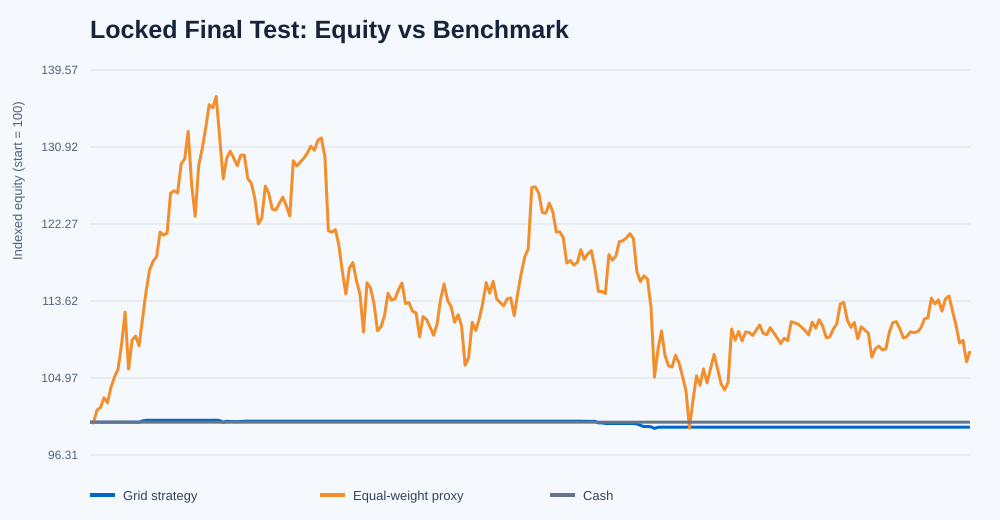
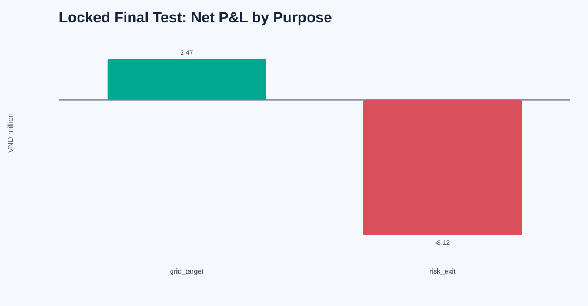
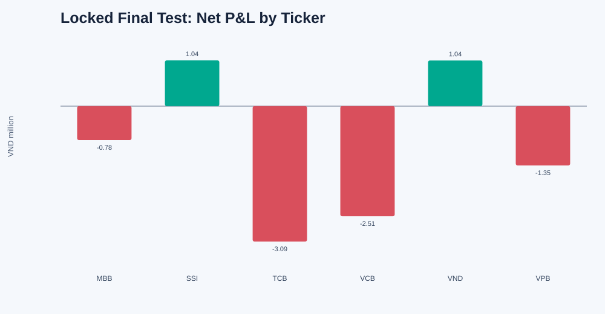
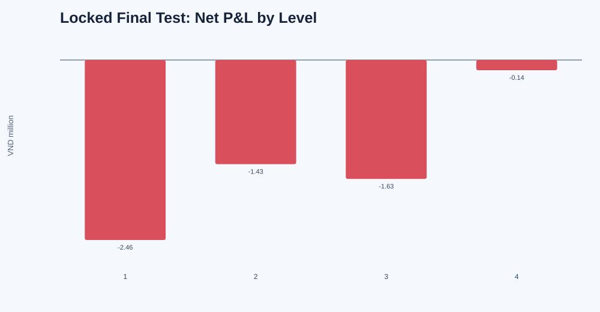

# Leakage-Controlled Grid Trading on Vietnamese Stocks

This repository tests a long-only grid strategy on six liquid HSX stocks:
MBB, SSI, TCB, VCB, VND and VPB. It uses daily data for causal selection and
grid construction, then minute bid/ask and matched-trade data for execution.

The final out-of-sample (OOS) test has now been opened once. It covers exactly
252 sessions from **2025-07-14 through 2026-07-16**. The frozen strategy lost
**VND 5,655,588 (-0.566%)**, while the gross equal-weight six-stock proxy
returned **+8.003%**.

The development gate had already failed in 2024. The final result is therefore
a diagnostic evaluation of a rejected model, not evidence that the model was
validated.

## Research hypothesis

Stocks that recently moved back and forth around a market-adjusted centre,
with enough movement to exceed estimated costs, may continue to provide
short-horizon reversal opportunities during the next month.

A negative price deviation alone is not treated as proof of reversal. The
selector first requires recent oscillation, adequate amplitude, observed
reversals, liquidity and acceptable downside conditions.
### Data source

- **Source:** Algotrade database
- **Daily data:** OHLC, ceiling, floor and matched volume
- **Minute data:** matched prices, level-one bid/ask, displayed depth and
  matched quantity
- **Length**: 2022-01-01 to 2026-07-16

## Chronological protocol

| Stage | Period | Sessions | Information use |
|---|---|---:|---|
| Selector development | 2022-01-04 to 2022-12-30 | 249 | Choose the selector horizon only |
| In-sample backtest | 2023-01-03 to 2023-12-29 | 249 | Test the initial trading rules |
| Optimization | 2024-01-02 to 2024-12-31 | 250 | Choose grid parameters |
| Internal diagnostic OOS | 2025-01-02 to 2025-06-30 | 119 | Diagnose the frozen strategy once |
| Exclusion buffer | 2025-07-01 to 2025-07-11 | 9 | Separate and settle the two OOS blocks |
| Final OOS | 2025-07-14 to 2026-07-16 | 252 | One-time final evaluation |

The split is strictly chronological and non-overlapping. For every monthly
deployment, the selection cutoff is earlier than the first tradable session.
The implementation reports zero selection/deployment overlaps in every stage.

## What is selected

The active implementation uses a 20-session lookback. For each stock it
removes movement associated with a leave-one-out equal-weight market proxy and
ranks eligible stocks equally on:

1. lower directional efficiency, meaning more back-and-forth residual movement;
2. larger residual amplitude after the estimated round-trip cost hurdle;
3. a higher observed reversal rate toward the recent centre.

Liquidity, spread, drawdown, recent-return and reversal-event checks are hard
eligibility gates. The selector chooses at most two stocks at each monthly
cutoff and freezes them for the following deployment month. A broad-market
veto may leave the strategy entirely in cash.

## Exact grid construction

This implementation uses a **geometric grid**
Consecutive levels are separated by approximately the same percentage rather
than the same VND amount.

### Reference price

For each selected stock, the reference price `R` is its daily closing price on
the monthly selection cutoff. It remains fixed during that deployment month.

### Grid spacing

First calculate the true range for each of the 20 completed daily sessions
available at the cutoff:

```text
true_range_t = max(
    high_t - low_t,
    abs(high_t - close_(t-1)),
    abs(low_t - close_(t-1))
)
```

The daily volatility estimate and frozen grid spacing are:

```text
ATR20_percentage = average(true_range_t / close_(t-1))

grid_spacing = min(2.5%, max(0.8%, 0.75 * ATR20_percentage))
```

Therefore:

- if `ATR20_percentage = 1.0%`, spacing is floored at `0.8%`;
- if `ATR20_percentage = 2.0%`, spacing is `1.5%`;
- if `ATR20_percentage = 4.0%`, spacing is capped at `2.5%`.

Spacing uses only completed **daily** data through the selection cutoff. It is
not based on intraday ATR, and transaction costs do not directly set the
spacing. Costs affect ticker eligibility and realized execution separately.

### Buy levels and sell targets

For grid level `k = 1, 2, 3, 4`:

```text
buy_level_k  = round_buy_to_HSX_tick(R / (1 + grid_spacing)^k)
sell_target_k = round_sell_to_HSX_tick(R / (1 + grid_spacing)^(k - 1))
```

Thus, level 1 buys below `R` and targets `R`; level 2 buys below level 1 and
targets level 1; and so on. Buy prices are rounded down and sell prices are
rounded up to the valid research tick size.

The frozen optimized grid uses:

- 4 geometric levels;
- at most 3 independent cells per level;
- 100 shares per cell;
- at most 2 selected stocks;
- at most 45% of current account equity allocated to each stock;
- a 10% nominal cash reserve before commission and cell-size limits.

For each ticker, 45% of equity is divided equally across four levels. The
number of 100-share cells at a level is the smaller of three and the number
affordable from that level's allocation. A fully populated grid therefore has
12 cells per ticker. If the full 90% notional were deployed, buy commission
would make the effective reserve slightly less than 10%; in practice the
three-cell cap and board-lot rounding usually leave more cash unused.

## Entry, exit and risk rules

- Buy limits are created after the monthly cutoff and can fill only on a later
  minute snapshot during the deployment period.
- A limit fills only when the relevant book price reaches the limit, the last
  trade confirms penetration, the spread is at most 40 basis points, displayed
  depth is sufficient, and the order is no more than 5% of minute volume.
- After a buy, its cell receives the sell target one geometric level higher.
- A sold cell can be rearmed only after its sale cash settles.
- New buys stop during the last 9 sessions of the deployment month.
- Scheduled liquidation starts during the last 5 sessions.
- A stock is disabled when its trailing 20-session return is at most -8%, or
  its previous close falls one tick below the deepest grid buy level.
- The account must be fully flat and settled before the next monthly campaign.

Execution applies a 5-basis-point adverse haircut per fill, 0.15% commission
on buys and sells, 0.10% tax on sells, 100-share board lots and T+2 settlement
at 13:00.

## Benchmark

The repository does not contain an official VN-Index series. The benchmark is
therefore explicitly labelled `equal_weight_bank_securities_proxy_gross`.
For each session it averages the adjusted daily returns of all six stocks and
compounds those returns without fees or tax. It is a daily equal-weight proxy,
not the grid's selected portfolio and not an official index.

## Results

| Evaluation block | Strategy return | Net P&L | Proxy return | Active return |
|---|---:|---:|---:|---:|
| 2023 in-sample | +0.0619% | +VND 618,617 | +33.3397% | -33.2778% |
| 2024 best optimization | -0.0678% | -VND 677,936 | +11.1912% | -11.2589% |
| 2025 H1 diagnostic OOS | -1.2670% | -VND 12,670,428 | +13.3931% | -14.6602% |
| 2025-07-14 to 2026-07-16 final OOS | **-0.5656%** | **-VND 5,655,588** | **+8.0034%** | **-8.5690%** |

All 12 optimization configurations lost money. The frozen configuration was
the least-negative one: four levels, 0.75 times ATR spacing, and three cells
per level.

### Final OOS controls

| Check | Result |
|---|---:|
| Frozen configuration hash | `96d02d50e5df00582c5eba186202570f7b49bcf3d74bfec36e4aec8c5286e9ab` |
| Final sessions | 252 |
| First / last session | 2025-07-14 / 2026-07-16 |
| Configuration changed after freeze | No |
| Selection/deployment overlaps | 0 |
| Ending inventory and pending cash | 0 |
| Account reconciliation difference | VND 0 |
| Completed sales / total fills | 69 / 138 |
| Active monthly deployments | 6 of 13 |

`frozen_config.json` still contains `locked_final_test_opened: false` because
that file is an immutable pre-OOS artifact covered by the frozen hash. The
current opened state is recorded separately in `final_oos_opening_manifest.json`
and `final_oos_summary.json` so the frozen file is not rewritten after seeing
the result.

The final OOS started with VND 1,000,000,000 and ended with VND 994,344,412.
Maximum strategy drawdown was 0.928%, versus 27.283% for the gross proxy.
The smaller drawdown largely reflects low exposure and long periods in cash;
it does not offset the negative active return.

### Where final OOS profit and loss came from

```text
gross trading P&L       -VND 4,695,000
commission              -VND   722,208
sell tax                -VND   238,380
---------------------------------------
net realized P&L        -VND 5,655,588
reconciliation error                VND 0
```

Execution friction was VND 615,000 and is already reflected in fill prices
and gross trading P&L; it must not be subtracted a second time.

| Exit type | Sales | Winners | Losers | Net P&L |
|---|---:|---:|---:|---:|
| Normal grid target | 18 | 18 | 0 | +VND 2,468,073 |
| Risk exit | 51 | 9 | 42 | -VND 8,123,661 |

The grid completed profitable target cycles, but their gains were outweighed
by forced exits. The loss was therefore not only a fee problem: gross trading
P&L was already negative before commission and tax. TCB was the largest ticker
loss at VND 3,093,144, followed by VCB at VND 2,514,540.

The stocks selected in active final-OOS deployments were:

| Deployment | Selected tickers |
|---|---|
| July-August 2025 | VND, SSI |
| September 2025 | VPB, MBB |
| February 2026 | TCB, VCB |
| March 2026 | MBB, TCB |
| July 2026 | VND, SSI |

The remaining months were blocked by the market veto. Selection does not imply
that an order filled; the July 2026 deployment produced no fills.

### Charts









Earlier-stage charts remain in their respective output directories:

- `data/sector_rotation_grid/in_sample/charts/`
- `data/sector_rotation_grid/optimization_best/charts/`
- `data/sector_rotation_grid/out_of_sample/charts/`

## Reproduction

The active strategy uses the Python standard library.

Create the chronological assignments and run the tests:

```bash
python3 create_sector_rotation_splits.py
python3 -m unittest discover -s tests -p 'test_*.py' -v
```

The development command creates the selector lock, 2023 in-sample result, 2024
optimization result and frozen configuration:

```bash
python3 sector_rotation_grid.py develop
```

The internal diagnostic OOS was opened once with:

```bash
python3 sector_rotation_grid.py oos \
  --confirm-frozen-config 96d02d50e5df00582c5eba186202570f7b49bcf3d74bfec36e4aec8c5286e9ab \
  --diagnostic-oos-after-failed-gate
```

The final OOS was opened once with:

```bash
python3 sector_rotation_grid.py final-oos \
  --confirm-frozen-config 96d02d50e5df00582c5eba186202570f7b49bcf3d74bfec36e4aec8c5286e9ab \
  --final-oos-after-failed-gate
```

The stored outputs make both OOS commands intentionally refuse a second run.
The opening manifest records the frozen hash and SHA-256 hashes of the source
and input files before final-period numeric data were loaded.

## Main files

```text
Grid_Trading_Strategy/
├── README.md
├── create_sector_rotation_splits.py
├── grid_platform.py
├── sector_rotation_grid.py
├── data_algotradeDB_split.csv
├── data/
│   ├── minute_bars/
│   ├── sector_rotation_splits/
│   └── sector_rotation_grid/
│       ├── frozen_config.json
│       ├── final_oos_opening_manifest.json
│       ├── final_oos_summary.json
│       ├── in_sample/
│       ├── optimization_best/
│       ├── out_of_sample/
│       └── final_out_of_sample/
└── tests/
```

The final result files are:

- `data/sector_rotation_grid/final_oos_summary.json`
- `data/sector_rotation_grid/final_out_of_sample/metrics.json`
- `data/sector_rotation_grid/final_out_of_sample/daily_account.csv`
- `data/sector_rotation_grid/final_out_of_sample/fills.csv`
- `data/sector_rotation_grid/final_out_of_sample/rotations.csv`
- `data/sector_rotation_grid/final_out_of_sample/diagnostics/`

## Conclusion

The geometric grid worked mechanically: 18 normal targets were completed and
all were profitable. Economically, the frozen hypothesis failed because 42
losing risk exits overwhelmed those small repeated gains. The result is robust
to the research protocol in the limited sense that the final dates, frozen
parameters, causal selection, account reconciliation and one-time opening are
verified. It is not a profitable or validated trading strategy.
